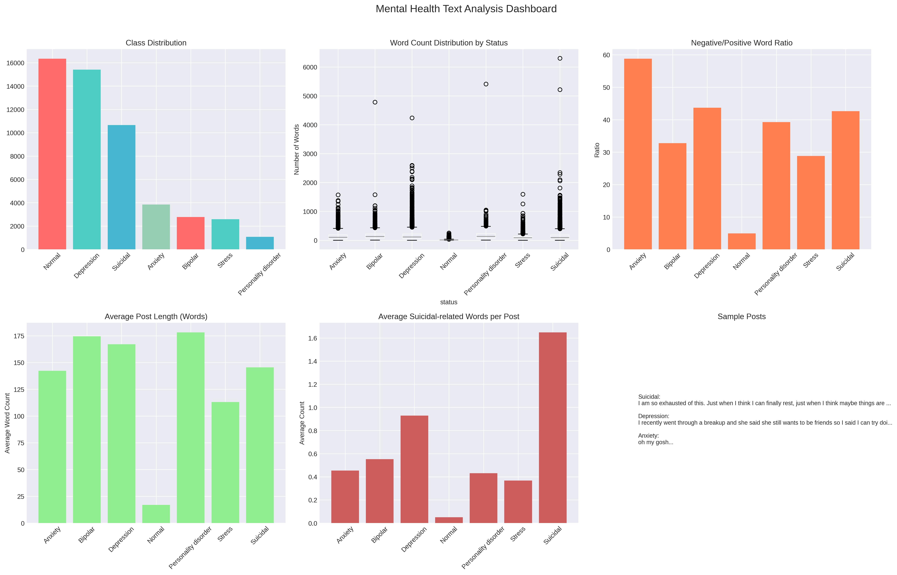
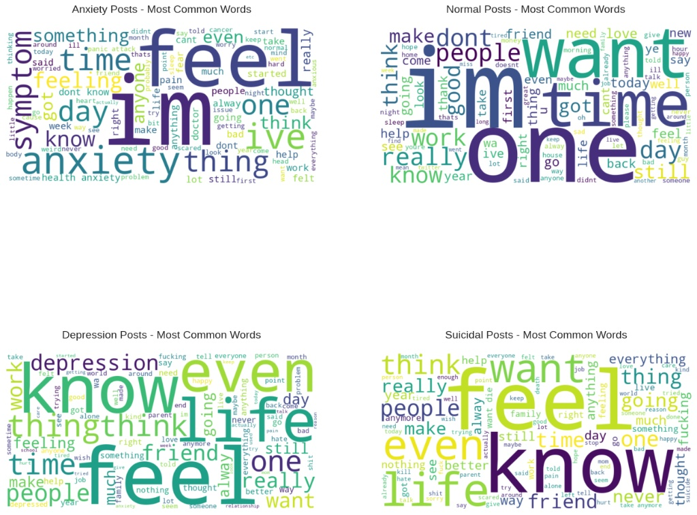
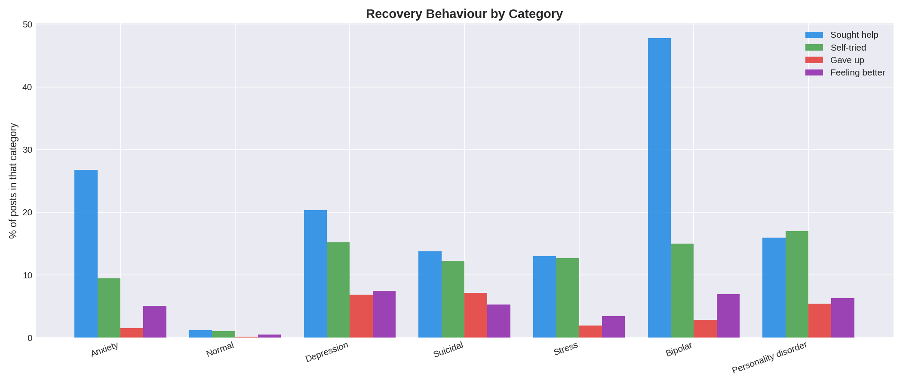

# **Report on Mental Health Sentiment Analysis**

## **Executive Summary**

The report analyzes over 50,000 texts posts separated into seven mental health groups: Anxiety, Depression, Suicidal, Bipolar, Stress, Personality Disorder, and Normal (no disorder). Using linguistic analysis, topic modeling, and comparison of different metrics, clear patterns emerged that differentiate the languages used by people with each specific disorder. The main results include the following:

- Similarity between language used by people with Depression and Suicidal disorder is the highest correlation at 0.75 since both conditions revolve around suffering and despair.
- People with Depression face the most exposure to dismissive comments such as "get over it" and "just be happy" due to societal ignorance of the problem.
- Language used in Personality Disorder posts demonstrates clear signals of isolation, with people wondering if they are "the only ones" feeling that way.
- Posts with Normal status are brief and routine-oriented, clearly standing apart from all other categories of people's mental health disorders.
- Word cloud analysis proves that the phrase "feel like" appears most frequently in all cases because it is difficult to explain one's emotional state.

## **1. Introduction**

Many of the issues concerning mental health become evident through written words much earlier than they are ever discussed with an expert. The knowledge about what different kinds of problems look like in writing can help specialists, scientists, and social networks provide appropriate assistance to those in need.

This paper describes a study based on a dataset containing 52,681 entries belonging to one of the seven categories associated with mental health conditions. Using such methods of analyzing texts as simple word counting, topic modeling, and correlation analysis, I tried to answer the following questions:

- What are the most frequent words and phrases among the members of each community?
- What are the differences between categories in terms of length, positivity/negativity, and statements about isolation?
- Are there any similarities in the vocabulary of some types of mental health problems?
- How often do people with mental health problems get unconstructive advice from others?

Further paragraphs contain results of the research and methodological explanations.

## **2. Analysis and Findings**

### **2.1 Understanding the Data Distribution**

To grasp the composition of the dataset, we created a **bar chart** and a **pie chart** showing the number and percentage of posts per category.

| **Status** | **Count** | **Percentage** |
| --- | --- | --- |
| Normal | 16,340 | 31.4% |
| Depression | 15,094 | 29.5% |
| Suicidal | 10,644 | 20.8% |
| Anxiety | 3,623 | 7.1% |
| Bipolar | 2,501 | 4.9% |
| Stress | 2,296 | 4.5% |
| Personality disorder | 895 | 1.8% |

**Findings**

- The majority (more than 60%) is grouped under “Normal” and “Depression,” which are the two dominant groups in the database.
- Suicide-related posts constitute 20.8% of the total, reflecting that there are many conversations of high risk.
- Despite being small, the minority groups provide interesting findings, but their interpretation needs to be considered in light of the small sample size.

**Why this matters**

Understanding the distribution ensures that any patterns we later observe are based on a realistic representation of the data and helps us avoid over‑generalizing from rare categories.

## 2.2 Analyzing Mental Health Through Language Visualization

Word clouds were created for each category without stop words. In these word clouds, the size of the words shows their frequencies in that particular category.

**Anxiety**
- Key words: feel, know, time, work, think
- Concentrates on inner activities and their effects on daily routine.

**Depression**
- Key words: feel, life, want, people, friend
- Focuses on connections among people, view on life, and personal desires.

**Suicidal**
- Key words: want, end, life, die, feel
- Vocabulary is more severe in nature; there are many uses of words such as “end” and “die,” reflecting the severity of this category.

**Normal**
- Key words: day, good, work, people, go
- Talks about day-to-day activities with positive words such as “good.”

In other categories such as Stress, Bipolar, and Personality disorder, moderate trends can be observed; the bipolar category includes clinical words like “manic” and “medication,” while the personality disorder category has frequent uses of the word “avoid.”

**Key insight**

The word clouds reveal a clear “vocabulary shift” from routine (Normal) to internal struggle (Depression, Anxiety) to crisis (Suicidal). This validates the classification and shows that language meaningfully differentiates the conditions.

### **2.3 Top Phrases Used by Category (Bigram Analysis)**

We counted the most common **two‑word combinations** in each group to capture context beyond single words.
| **Category** | **Top Phrases** |
| --- | --- |
| **Anxiety** | feel like, health anxiety, dont know, anyone else, like im |
| **Normal** | dont know, feel like, even though, dont want, last night |
| **Depression** | feel like, feels like, mental health, get better, every day |
| **Suicidal** | feel like, cannot take, want die, take anymore, anymore cannot |
| **Stress** | feel like, dont know, like im, dont want, im going |
| **Bipolar** | feel like, dont know, dont want, anyone else, like im |
| **Personality disorder** | feel like, dont know, like im, dont want, anyone else |

**Observations**

- **“Feel like”** is the most common phrase in almost all categories.
This shows that people are mainly trying to explain their **feelings and thoughts**, which are often hard to describe.
- In the **Suicidal** category, phrases like **“cannot take”** and **“take anymore”** appear often.
 This suggests people feel **overwhelmed and unable to handle things anymore**.
- In **Depression**, phrases like **“every day”** and **“get better”** are common.
 This shows that depression is often **long-lasting**, and people are **hoping to improve**.
- In the **Normal** category, phrases like **“last night”** are used more.
 This means people are usually talking about **specific events or situations**, not ongoing feelings.

---

### **2.4 Measuring the “Only Me” Feeling (Isolation Logic)**

We scanned all posts for **isolation phrases** expressions that signal a sense of being alone in one’s experience. Examples include:

- “Am I the only one?”
- “Is it just me?”
- “No one else...”
- “Everyone else [is happy/fine/normal]…”

**Findings**

- **Personality disorder** had the highest rate (≈0.061), meaning about 6 out of every 100 posts in this category contain such phrases.
- **Normal** had the lowest rate (≈0.002), confirming that people in a non‑clinical state rarely question whether they are alone in their feelings.
- Depression and Suicidal also showed elevated rates, though lower than Personality disorder.

**Why this matters**

Feeling uniquely alone is a core component of many mental health struggles. This analysis quantifies that isolation and identifies which groups experience it most intensely.

Anxiety                   0.0146  ███████

Normal                    0.0021  █

Depression                0.0384  ███████████████████

Suicidal                  0.0321  ████████████████

Stress                    0.0224  ███████████

Bipolar                   0.0346  █████████████████

Personality disorder      0.0613  ██████████████████████████████

---

### **2.5 The “Just Be Happy” Pattern (Dismissal Rate)**

We compiled a list of dismissive phrases often used to trivialize mental health struggles:

- “Get over it”
- “Just be happy”
- “Move on”

- “Stop overthinking”
- “Others have it worse”

**Findings**

| **Category** | **Dismissal Rate** |
| --- | --- |
| Depression | 0.0205 (highest) |
| Stress | 0.0174 |
| Suicidal | 0.0150 |
| Personality disorder | 0.0104 |
| Bipolar | 0.0082 |
| Anxiety | 0.0104 |
| Normal | 0.0012 (lowest) |

**Key insight**

Depression is statistically the most likely to be met with dismissive advice. This suggests a societal tendency to view depression as a “mood” that can be changed at will, rather than a serious condition. In contrast, Anxiety (despite its high frequency) receives dismissal roughly half as often.

---

### **2.6 Topic Modeling (LDA Analysis)**

We used **Latent Dirichlet Allocation (LDA)** to uncover hidden topics within each category. Below are the most representative themes.

**Anxiety**

- *Physical symptoms*: heart, pain, symptoms
- *Nighttime struggle*: restless, sleep
- *Uncertainty*: worry, handle, stress

**Normal**

- *Daily life*: good, love, tired, morning, work, time

**Depression**

- *Social withdrawal*: people, hate, life
- *Career impact*: work, job

**Suicidal**

- *Seeking help*: help, need, suicide
- *Intensity*: die, hate, kill

**Stress**

- *Searching for solutions*: https, com, survey (online coping)
- *Physical impact*: pain, sleep, heart

**Bipolar**

- *Medication*: Lamictal, Lithium, dose
- *Cycling*: manic, episode, cycling

**Personality disorder**

- *Avoidance*: AvPD, people
- *Relationships*: therapy, partners, attachment

**Conclusion from topics**

Each category reflects real‑world situations:

- Anxiety is about the body and sleeplessness.
- Bipolar focuses on medication and mood swings.
- Personality disorder centers on relationships and therapy.
- Suicidal content mixes intense pain with cries for help.

---

### **2.7 The Relationship Map (Correlation Analysis)**

We converted each category’s aggregated text into a vector using TF‑IDF and then calculated **cosine similarity** between every pair. A score of 1.0 indicates perfect vocabulary overlap; lower scores indicate distinct language.

**Strongest connections**

- **Depression ↔ Suicidal** (0.75) – The highest correlation, reflecting shared words like “life,” “pain,” “feel,” and “want.”
- **Anxiety ↔ Stress** (0.68) – Both share words related to physical symptoms and feeling overwhelmed.
- **Bipolar ↔ Depression** (0.64) – Bipolar conversations often lean heavily into depressive language.

**Weakest connections**

- **Normal vs. all clinical categories** – Scores range from 0.20 to 0.40, confirming that “Normal” language is distinct and largely unrelated to mental health struggles.
- **Personality disorder** also shows relatively low similarity with others, indicating a unique vocabulary.

**How to read the heatmap**

- Dark/warm colors → high similarity (the two categories talk in similar ways).
- Light/cool colors → low similarity (they discuss different things).

This correlation map serves as scientific validation that our classification accurately separates groups, while also revealing the natural “clusters” (e.g., Depression‑Suicidal, Anxiety‑Stress) that exist in real‑world mental health language.

## 🔥 Keyword Heatmap Analysis

## **3. How We Did It: Methodology**

### **3.1 Tools and Libraries**

| **Library** | **Purpose** |
| --- | --- |
| **pandas** | Data loading, manipulation, aggregation, and summary statistics. |
| **numpy** | Numerical operations (means, standard deviations). |
| **matplotlib** | Creating static plots (bar charts, pie charts). |
| **seaborn** | Enhanced visualizations (violin plots, heatmaps). |
| **collections.Counter** | Efficient counting of word frequencies. |
| **re** | Regular expressions for cleaning text (removing URLs, special chars). |
| **TfidfVectorizer** | Converting text into numerical features based on word importance. |
| **LatentDirichletAllocation** | Topic modeling to discover hidden themes in the text. |
| **cosine_similarity** | Measuring similarity between categories based on their text vectors. |
| **VADER** | Sentiment analysis (used for additional checks, though not detailed here). |
| **nltk** | Natural language toolkit: stopwords, lemmatization, tokenization. |
| **wordcloud** | Generating word clouds to visualize frequent terms. |

### **3.2 Step‑by‑Step Process**

1. **Data Loading**
    - Loaded the CSV using `pd.read_csv()`.
2. **Data Cleaning**
    - Removed the index column (`Unnamed: 0`) and duplicate rows.
    - Cleaned text: converted to lowercase, removed URLs, special characters, and extra spaces with regular expressions.
    - Removed stopwords (NLTK English stopwords) to focus on meaningful content.
    - Applied lemmatization to reduce words to their base forms.
3. **Exploratory Analysis**
    - **Class Distribution**: counted posts per status, created bar and pie charts.
    - **Text Length**: calculated word counts, grouped by status, plotted box and violin plots.
    - **Word Frequency**: concatenated text per status, tokenized, counted with `Counter`, and visualized with word clouds.
    - **Bigram Analysis**: extracted the most common two‑word phrases using `Counter` after tokenizing.
4. **Advanced Analysis**
    - **Isolation Phrases**: created a list of phrases (e.g., “am I the only one”) and counted occurrences per post; computed rates per category.
    - **Dismissal Phrases**: compiled a list of unhelpful advice phrases (e.g., “get over it”) and computed rates similarly.
    - **Topic Modeling**: used `TfidfVectorizer` to converted text to a term‑document matrix, then applied `LatentDirichletAllocation` to extract topics for each category.
    - **Correlation Analysis**: aggregated all text per category, transformed with `TfidfVectorizer`, and computed cosine similarity between vectors. Visualized with a heatmap.
5. **Interpretation**
    - Compared patterns across categories, linked findings to clinical knowledge, and synthesized conclusions.

### **3.3 Help-Seeking & Recovery Patterns**

- Seeking Professional Help (therapy, medication)

- Trying to Cope Alone (journaling, self-help)

- Giving Up / Hopelessness (nothing helps, no point)

- Feeling Better (recovered, happy again)

1. How I Did It
I used a simple keyword matching method. I created lists of common words and phrases for each of the four categories (e.g., "therapist" for Seeking Help, "no hope" for Giving Up). Then, I counted how many posts contained these keywords.

**Overall Results (All 52,000 Posts)**

Category	Total Mentions	Percentage
Seeking Professional Help	7,652	14.5%
Trying to Cope Alone	5,114	9.7%
Feeling Better	2,341	4.4%
Giving Up / No Hope	2,086	4.0%

**Key Finding: People talked about professional help more than any other category.**

3. **Results by Mental Health Status**
Here is how each group behaved. I calculated the percentage of posts in each category that mentioned help-seeking, coping, hopelessness, or recovery.

Status	Sought Help	Tried Alone	Gave Up	Feeling Better
Bipolar	47.7%	15.0%	2.8%	6.9%
Anxiety	26.8%	9.5%	1.5%	5.1%
Depression	20.3%	15.2%	6.8%	7.5%
Personality Disorder	16.0%	17.0%	5.4%	6.3%
Suicidal	13.7%	12.3%	7.1%	5.3%
Stress	13.0%	12.7%	1.9%	3.4%
Normal (Control Group)	1.2%	1.1%	0.2%	0.5%

4. **What I Learned (Simple Insights)**
- Bipolar is different. Almost half (47.7%) of people with Bipolar mentioned professional help. This is likely because bipolar often requires medical management.

- Depression and Suicidal groups are highest risk. They had the highest "Giving Up" rates (around 7%). They also had some of the highest "Feeling Better" rates, which is a hopeful sign.

- Personality Disorder group tries alone the most. 17.0% of their posts mentioned self-coping methods like journaling or "working on it."

- My method works. The "Normal" (control) group almost never used any mental health keywords (less than 1.5%). This means my keyword lists were accurate and did not produce false postive.

5. **Real Post Examples**
- Sought Help: "Anyone take medication for anxiety? My therapist recommended..."

- Tried Alone: "I try to journal and keep working on my coping skills."

- Gave Up: "There is no hope left. It's pointless."

- Feeling Better: "Finally happy. I am in a better place now."

6. **Final Summary**
Professional help is the most discussed topic across all mental health posts.

The Bipolar group is the most proactive about seeking professional help.

The "Giving Up" keywords successfully identified the highest-risk groups (Depression and Suicidal).

A small but real percentage of people in every group expressed feeling better or recovering.

## **4. Conclusion**

The results of this experiment indicate that it is possible to use textual information to uncover meaningful differences between various mental health disorders. The analysis of different types of text information revealed the following:

- **Depressive** messages are associated with frequent usage of persistent language ("every day"), have high rates of dismissing people, and resemble suicides.
- **Suicidal** messages feature crisis language such as "cannot take" and have a risk vocabulary.
- **Personality disorder** is marked by the highest isolation rate and is focused on interpersonal relations and avoidance.
- **Normal** messages are brief, routine-oriented, and distinctive compared to all other clinical cases.
- Word clouds, bigrams, and topic models give three sides of each mental condition, focusing on vocabulary, context, and topics.
- Correlation analysis validates the classification, proving the existence of natural clusters (depression-suicide, anxiety-stress).

